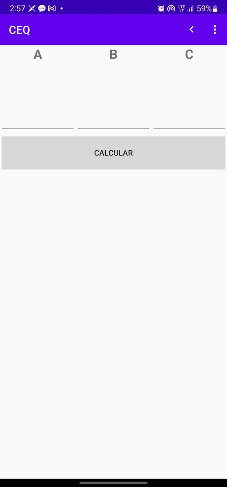
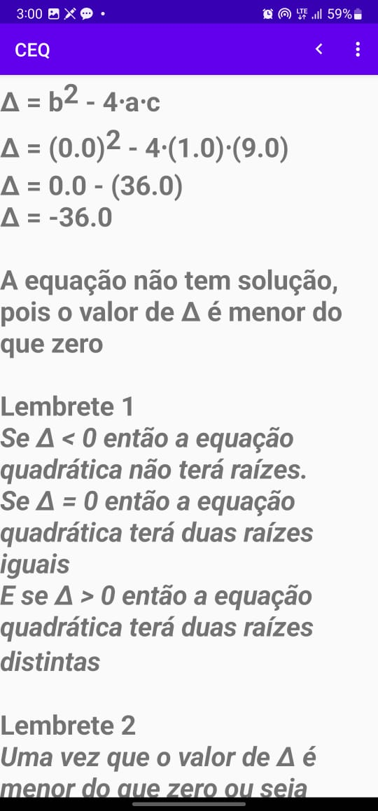

QEC – Quadratic Equations Calculator - Android Mobile App

This is a mobile application developed using Java and Android Studio.
The app was originally created as a complete, production-ready software solution.

Although the original source code is no longer available, the compiled application (APK) is included in the /release folder and can be installed on any Android device.

🚀 Features

Developed using Java

Built in Android Studio

Production-ready APK

Simple and functional UI

📱 Installation

1. Download the APK from the /release folder

2. Install it on an Android device

3. Allow installation from unknown sources

4. Run the app normally

👨‍💻 Author

Egas Viegas Portugal
GitHub: https://github.com/portuga-vivi

## 📸 Screenshots

### Help Screen  

### Input Screen  

### Result Screen  

### Contact Screen  

